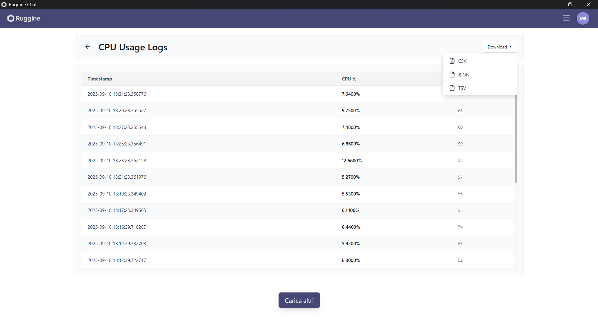

# Ruggine Chat

## Overview
Ruggine Chat is a cross-platform client-server chat application developed in Rust. Designed for the Programmazione di Sistema course, the project emphasizes memory safety, multi-threading, and optimal resource utilization. 


## System Architecture and Code Structure
The application leverages thread-safe structures (`Arc`, `Mutex`) and asynchronous channels (`mpsc`) to support high concurrency. The workspace is divided into two primary crates:

```text
ruggine-chat/
├── ruggine_server/          # Backend TCP server
│   ├── src/main.rs          # Entry point and connection listener
│   └── src/                 # Core server logic (sessions, routing, DB logging)
└── ruggine_client/          # Desktop GUI client
    └── src/                 # Frontend views and server communication
```

## Technical Specifications
- **Concurrency & Networking**: Custom TCP-based communication protocol designed to handle multiple simultaneous client connections without blocking.
- **Resource Optimization**: Engineered for minimal system footprint, strictly adhering to an executable size limit of under 30MB.
- **Performance Telemetry**: Includes an automated background telemetry system that records and logs the server's CPU usage to a database every two minutes for performance tracking.
- **Cross-Platform Support**: Tested and compiled for execution across Windows, Linux, macOS, and Android platforms.



## Build and Execution

### Requirements
- Rust Toolchain (1.70+)

### Instructions
1. **Server Initialization**:
```bash
cd ruggine_server
cargo run --release
```

2. **Client Initialization**:
```bash
cd ruggine_client
cargo run --release
```
