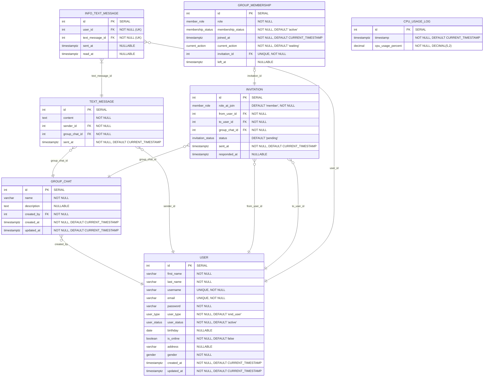

## ER Diagram



### Database ENUMs

```sql
-- User classification and status enums
CREATE TYPE user_type AS ENUM ('end_user', 'developer', 'admin');
CREATE TYPE user_status AS ENUM ('pending', 'active', 'suspended', 'deleted', 'banned');
CREATE TYPE current_action AS ENUM ('waiting', 'writing');
CREATE TYPE gender AS ENUM ('male', 'female', 'other');

-- Message and group management enums
CREATE TYPE member_role AS ENUM ('admin', 'member');
CREATE TYPE invitation_status AS ENUM ('pending', 'accepted', 'declined');

-- Group membership status
CREATE TYPE membership_status AS ENUM ('active', 'left', 'banned');
```