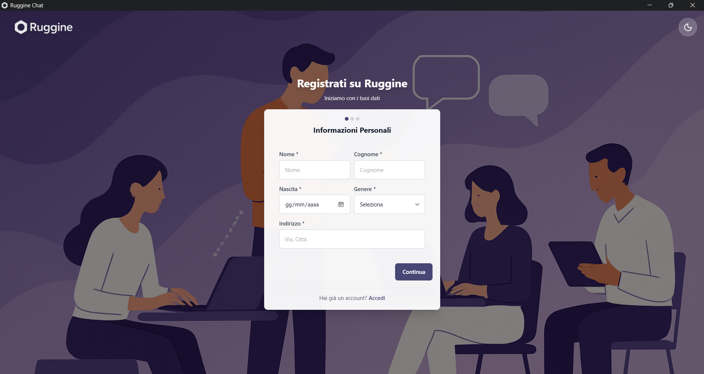
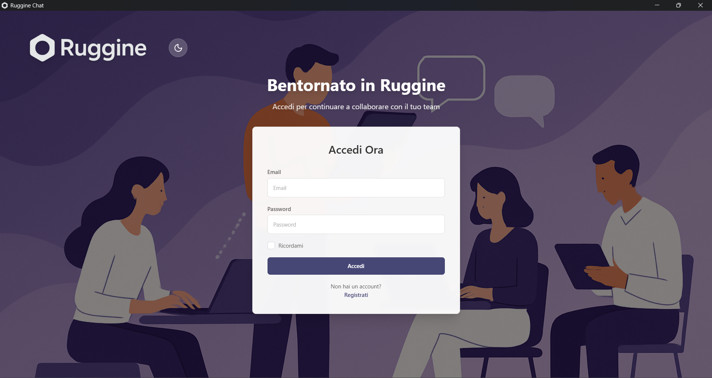
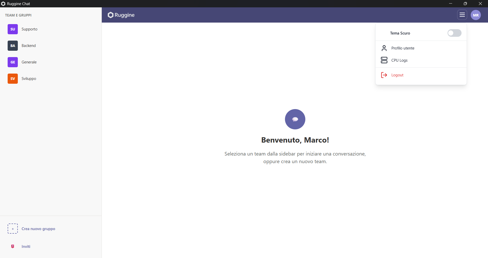
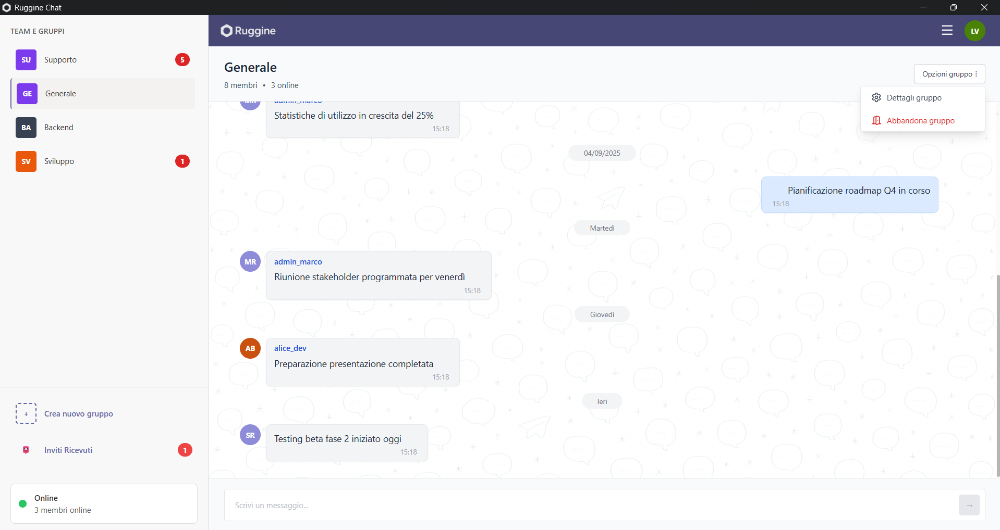
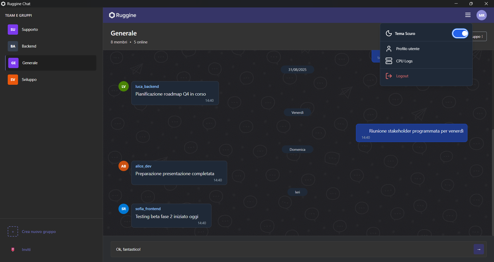
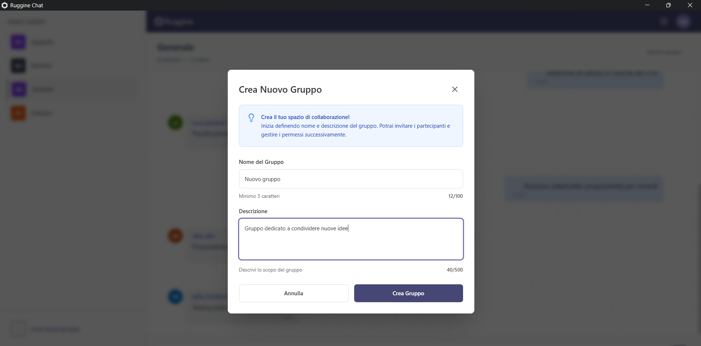
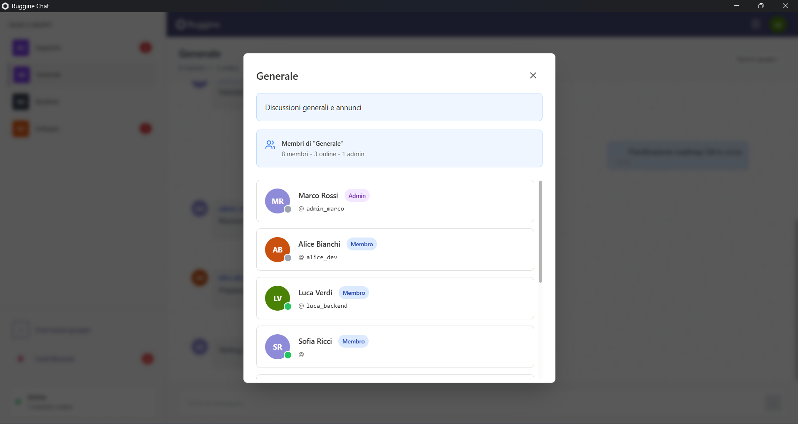
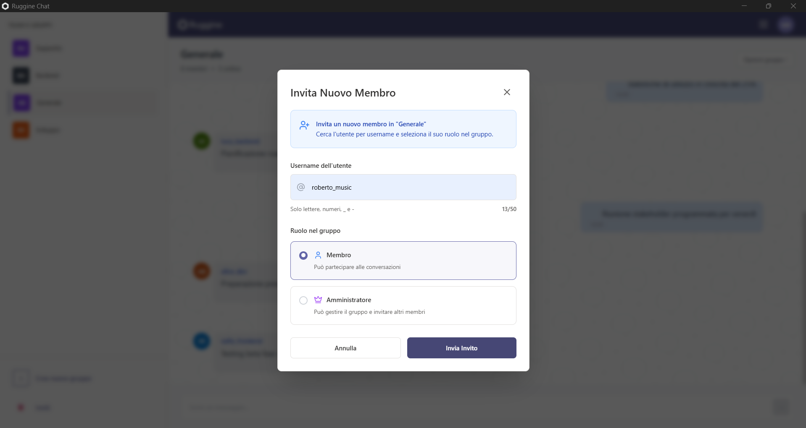

# Manuale Utente - Ruggine Chat

## Indice
1. [Introduzione](#introduzione)
2. [Requisiti di Sistema](#requisiti-di-sistema)
3. [Installazione](#installazione)
4. [Primo Avvio e Registrazione](#primo-avvio-e-registrazione)
5. [Interfaccia Utente](#interfaccia-utente)
6. [Funzionalità Principali](#funzionalità-principali)
7. [Gestione Gruppi](#gestione-gruppi)
8. [Inviti e Partecipazione](#inviti-e-partecipazione)
9. [Impostazioni](#impostazioni)
10. [Risoluzione Problemi](#risoluzione-problemi)
11. [FAQ](#faq)
12. [Supporto](#supporto)

---

## 1. Introduzione

**Ruggine Chat** è un'applicazione di messaggistica istantanea moderna e sicura, progettata per comunicazioni di gruppo in tempo reale. L'applicazione offre:

- ✅ Chat di gruppo in tempo reale
- ✅ Interfaccia utente intuitiva e responsive
- ✅ Tema chiaro/scuro personalizzabile
- ✅ Sistema di inviti per nuovi membri
- ✅ Sincronizzazione cross-platform
- ✅ Sicurezza e privacy avanzate

---

## 2. Requisiti di Sistema

### Windows
- **Sistema Operativo**: Windows 10 (versione 1903 o superiore) o Windows 11
- **Architettura**: x64 (64-bit)
- **RAM**: Minimo 4 GB
- **Spazio disco**: 100 MB disponibili
- **Connessione**: Internet richiesta per il funzionamento

### macOS (Supporto futuro)
- **Sistema Operativo**: macOS 10.13 (High Sierra) o superiore
- **Architettura**: Intel x64 o Apple Silicon (M1/M2)
- **RAM**: Minimo 4 GB
- **Spazio disco**: 100 MB disponibili

### Linux (Supporto futuro)
- **Distribuzioni supportate**: Ubuntu 18.04+, Debian 10+, Fedora 32+
- **Architettura**: x64 (64-bit)
- **RAM**: Minimo 4 GB
- **Spazio disco**: 100 MB disponibili

---

## 3. Installazione

### 3.1 Download dell'Installer

1. Scarica l'installer appropriato per il tuo sistema dalla sezione release del progetto
2. Per Windows sono disponibili due opzioni:
   - **MSI Installer** (`Ruggine Chat_x.x.x_x64_en-US.msi`) - Raccomandato per installazioni aziendali
   - **NSIS Installer** (`Ruggine Chat_x.x.x_x64-setup.exe`) - Installer semplificato

### 3.2 Installazione su Windows

#### Usando MSI Installer:
1. Fai doppio clic sul file `.msi` scaricato
2. Segui la procedura guidata di installazione
3. Accetta i termini di licenza
4. Scegli la cartella di destinazione (predefinita: `C:\Program Files\Ruggine Chat`)
5. Clicca su "Installa"
6. Al termine, l'applicazione sarà disponibile nel Menu Start

#### Usando NSIS Installer:
1. Fai doppio clic sul file `-setup.exe` scaricato
2. Se Windows mostra un avviso di sicurezza, clicca su "Ulteriori informazioni" e poi "Esegui comunque"
3. Segui la procedura guidata:
   - Benvenuto nell'installazione
   - Accettazione licenza
   - Scelta cartella di installazione
   - Selezione componenti (collegamento desktop, menu Start)
4. Clicca su "Installa"
5. Al termine dell'installazione, puoi scegliere di avviare immediatamente l'applicazione

### 3.3 Verifica dell'Installazione

Dopo l'installazione:
1. Cerca "Ruggine Chat" nel Menu Start di Windows
2. Oppure utilizza il collegamento sul desktop (se creato)
3. Al primo avvio, l'applicazione dovrebbe aprirsi senza errori

---

## 4. Primo Avvio e Registrazione

### 4.1 Configurazione Iniziale

Al primo avvio di Ruggine Chat:

1. **Schermata di Benvenuto**: Si aprirà la pagina di login/registrazione
2. **Configurazione Server**: L'applicazione si connetterà automaticamente al server configurato

### 4.2 Registrazione Nuovo Account


*Figura 1: Schermata di registrazione nuovo account*

1. Nella schermata iniziale, clicca su **"Registrati"**
2. Compila il modulo di registrazione:
   - **Nome utente**: Scegli un nome utente unico (3-50 caratteri)
   - **Email**: Inserisci un indirizzo email valido
   - **Password**: Crea una password sicura (minimo 8 caratteri)
   - **Conferma Password**: Ripeti la password per conferma
3. Clicca su **"Registrati"**
4. Se i dati sono corretti, sarai reindirizzato alla dashboard principale

### 4.3 Login con Account Esistente


*Figura 2: Schermata di login con account esistente*

1. Nella schermata iniziale, inserisci:
   - **Email**: Il tuo indirizzo email registrato
   - **Password**: La tua password
2. Clicca su **"Accedi"**
3. Se le credenziali sono corrette, accederai alla dashboard

### 4.4 Gestione Errori di Login

Se riscontri problemi durante il login:
- **Credenziali errate**: Verifica email e password
- **Account non trovato**: Assicurati di essere registrato o procedi con la registrazione
- **Problemi di connessione**: Controlla la tua connessione internet

---

## 5. Interfaccia Utente

### 5.1 Layout Principale


*Figura 3: Dashboard principale di Ruggine Chat*

L'interfaccia di Ruggine Chat è divisa in sezioni principali:

```
┌─────────────────────────────────────────────────────────┐
│ [Logo] Ruggine Chat           [Tema] [Profilo] [Logout] │ ← Header
├─────────────────┬───────────────────────────────────────┤
│                 │                                       │
│   Lista Gruppi  │           Area Chat Principale        │ ← Contenuto
│                 │                                       │
│  - Gruppo 1     │  ┌─────────────────────────────────┐  │
│  - Gruppo 2     │  │        Messaggi Chat            │  │
│  - Gruppo 3     │  │                                 │  │
│                 │  └─────────────────────────────────┘  │
│                 │  [Input Messaggio...] [Invia]         │
├─────────────────┴───────────────────────────────────────┤
│              Footer / Stato Connessione                 │ ← Footer
└─────────────────────────────────────────────────────────┘
```

### 5.2 Componenti dell'Interfaccia

#### Header (Barra Superiore)
- **Logo Ruggine Chat**: Torna alla dashboard principale
- **Toggle Tema**: Passa tra tema chiaro e scuro
- **Menu Profilo**: Accesso alle impostazioni utente
- **Logout**: Esci dall'applicazione

#### Sidebar Sinistra (Lista Gruppi)
- **Lista Gruppi**: Tutti i gruppi di cui fai parte
- **Indicatori Messaggi Non Letti**: Badge numerici sui gruppi con nuovi messaggi
- **Pulsante Nuovo Gruppo**: Crea un nuovo gruppo (se disponibile)

#### Area Centrale (Chat)
- **Header Chat**: Nome del gruppo selezionato e numero partecipanti
- **Area Messaggi**: Cronologia messaggi del gruppo
- **Input Messaggio**: Campo per scrivere nuovi messaggi
- **Pulsante Invio**: Invia il messaggio

---

## 6. Funzionalità Principali

### 6.1 Invio Messaggi


*Figura 4: Area chat con conversazione attiva*

1. **Seleziona un Gruppo**: Clicca su un gruppo nella sidebar sinistra
2. **Scrivi il Messaggio**: Digita il tuo messaggio nell'area di input in basso
3. **Invia**: 
   - Premi **Enter** sulla tastiera, oppure
   - Clicca sul pulsante **"Invia"**
4. Il messaggio apparirà immediatamente nella chat

#### Caratteristiche dei Messaggi:
- **Lunghezza massima**: 1000 caratteri per messaggio
- **Formattazione**: Supporto per testo semplice
- **Timestamp**: Ogni messaggio mostra data e ora di invio
- **Autore**: Il nome dell'utente che ha inviato il messaggio

### 6.2 Ricezione Messaggi

- I **messaggi in tempo reale** appaiono automaticamente
- I **messaggi non letti** sono evidenziati con badge numerici sui gruppi
- **Scroll automatico**: La chat scorre automaticamente ai nuovi messaggi
- **Notifiche**: (Se abilitate) riceverai notifiche per nuovi messaggi

### 6.3 Cambio Tema


*Figura 5: Confronto tra tema chiaro (sinistra) e tema scuro (destra)*

1. Clicca sull'icona **tema** (sole/luna) nell'header
2. L'interfaccia passerà automaticamente tra:
   - **Tema Chiaro**: Sfondo bianco, testo scuro
   - **Tema Scuro**: Sfondo scuro, testo chiaro
3. La preferenza viene salvata automaticamente

---

## 7. Gestione Gruppi

### 7.1 Visualizzazione Gruppi

- **Lista Gruppi**: Tutti i tuoi gruppi sono elencati nella sidebar sinistra
- **Gruppo Attivo**: Il gruppo attualmente selezionato è evidenziato
- **Indicatori Attività**: Badge con numero di messaggi non letti

### 7.2 Creazione Nuovo Gruppo


*Figura 6: Modal per la creazione di un nuovo gruppo*

1. Clicca sul pulsante **"+ Nuovo Gruppo"** (se disponibile)
2. Compila il modulo:
   - **Nome Gruppo**: Scegli un nome descrittivo (max 256 caratteri)
   - **Descrizione**: (Opzionale) Breve descrizione del gruppo (max 1024 caratteri)
3. Clicca su **"Crea Gruppo"**
4. Il nuovo gruppo apparirà nella tua lista

### 7.3 Impostazioni Gruppo


*Figura 7: Pannello impostazioni gruppo con lista membri*

Per accedere alle impostazioni di un gruppo:
1. Seleziona il gruppo
2. Clicca sull'icona **impostazioni** (ingranaggio) nell'header della chat
3. Potrai vedere:
   - **Informazioni Gruppo**: Nome, descrizione, data creazione
   - **Lista Membri**: Tutti i partecipanti del gruppo
   - **Gestione Membri**: (Solo amministratori) Invita o rimuovi membri

---

## 8. Inviti e Partecipazione

### 8.1 Ricevere Inviti

Quando ricevi un invito a un gruppo:
1. **Notifica Invito**: Riceverai una notifica di nuovo invito
2. **Lista Inviti**: Gli inviti in sospeso sono visibili in una sezione dedicata
3. **Dettagli Invito**: Puoi vedere chi ti ha invitato e in quale gruppo

### 8.2 Gestire Inviti Ricevuti


*Figura 8: Modal con lista degli inviti ricevuti*

Per ogni invito ricevuto puoi:

#### Accettare un Invito:
1. Apri la **lista inviti** dal menu principale
2. Trova l'invito che vuoi accettare
3. Clicca su **"Accetta"**
4. Il gruppo verrà aggiunto alla tua lista gruppi
5. Potrai immediatamente partecipare alle conversazioni

#### Rifiutare un Invito:
1. Apri la **lista inviti**
2. Trova l'invito che vuoi rifiutare
3. Clicca su **"Rifiuta"**
4. L'invito verrà rimosso dalla lista

### 8.3 Inviare Inviti (Solo Amministratori)


*Figura 9: Modal per invitare un nuovo membro al gruppo*

Se sei amministratore di un gruppo:
1. Vai alle **impostazioni del gruppo**
2. Clicca su **"Invita Membro"**
3. Inserisci il **nome utente** della persona da invitare
4. Seleziona il **ruolo** (Membro/Amministratore)
5. Clicca su **"Invia Invito"**
6. L'utente riceverà l'invito nella sua lista

---

## 9. Impostazioni

### 9.1 Accesso alle Impostazioni


*Figura 10: Menu profilo con opzioni disponibili*

1. Clicca sul **menu profilo** nell'header (icona utente)
2. Seleziona **"Impostazioni"** dal menu a tendina

### 9.2 Impostazioni Disponibili

#### Profilo Utente:
- **Nome Visualizzato**: Modifica come appari agli altri utenti
- **Stato**: Imposta il tuo stato (Online/Assente/Non Disturbare)
- **Avatar**: (Se supportato) Carica una foto profilo

#### Preferenze Interfaccia:
- **Tema**: Scegli tra tema chiaro e scuro
- **Lingua**: Seleziona la lingua dell'interfaccia
- **Dimensione Font**: Regola la dimensione del testo

#### Notifiche:
- **Notifiche Desktop**: Abilita/disabilita notifiche di sistema
- **Suoni**: Abilita/disabilita suoni di notifica
- **Anteprima Messaggi**: Mostra/nascondi anteprima nei popup

#### Privacy e Sicurezza:
- **Stato Online**: Chi può vedere quando sei online
- **Lettura Messaggi**: Mostra/nascondi conferme di lettura

---

## 10. Risoluzione Problemi

### 10.1 Problemi di Connessione

**Sintomi**: L'applicazione non si connette o perde la connessione
**Soluzioni**:
1. Verifica la connessione internet
2. Controlla se il server è raggiungibile
3. Riavvia l'applicazione
4. Verifica le impostazioni firewall/antivirus

### 10.2 Problemi di Login

**Sintomi**: Non riesci ad accedere con le tue credenziali
**Soluzioni**:
1. Verifica email e password
2. Controlla se Caps Lock è attivo
3. Prova a reimpostare la password
4. Contatta l'amministratore se il problema persiste

### 10.3 Messaggi Non Inviati

**Sintomi**: I messaggi non vengono inviati o rimangono in "invio"
**Soluzioni**:
1. Controlla la connessione internet
2. Verifica di essere ancora connesso al gruppo
3. Ricarica la pagina/riavvia l'app
4. Controlla se il messaggio è troppo lungo

### 10.4 Prestazioni Lente

**Sintomi**: L'applicazione è lenta o si blocca
**Soluzioni**:
1. Chiudi altre applicazioni per liberare memoria
2. Riavvia l'applicazione
3. Verifica i requisiti di sistema
4. Aggiorna l'applicazione all'ultima versione

### 10.5 Problemi di Visualizzazione

**Sintomi**: L'interfaccia non si visualizza correttamente
**Soluzioni**:
1. Prova a cambiare tema (chiaro/scuro)
2. Modifica la dimensione del font nelle impostazioni
3. Riavvia l'applicazione
4. Verifica la risoluzione dello schermo

---

## 11. FAQ (Domande Frequenti)

### Q: Come posso cambiare la mia password?
**A**: Attualmente la funzione di cambio password non è disponibile nell'interfaccia. Contatta l'amministratore del sistema.

### Q: Posso essere in più gruppi contemporaneamente?
**A**: Sì, puoi partecipare a multipli gruppi (fino a 50) e passare tra di essi nella sidebar.

### Q: Come faccio a sapere se un messaggio è stato letto?
**A**: Attualmente non sono disponibili indicatori di lettura messaggi.

### Q: Posso inviare file o immagini?
**A**: Attualmente Ruggine Chat supporta solo messaggi di testo. Il supporto per file e media è previsto in future versioni.

### Q: L'applicazione funziona offline?
**A**: No, Ruggine Chat richiede una connessione internet attiva per funzionare.

### Q: Come posso eliminare un messaggio inviato?
**A**: Attualmente non è possibile eliminare messaggi già inviati.

### Q: Quanti caratteri posso scrivere in un messaggio?
**A**: Ogni messaggio può contenere fino a 1000 caratteri.

### Q: Come esco da un gruppo?
**A**: Attualmente non è possibile uscire autonomamente da un gruppo. Contatta l'amministratore del gruppo.

---

## 12. Supporto

### 12.1 Informazioni di Contatto

Per assistenza tecnica o domande:
- **Email Supporto**: [Inserire email di supporto]
- **Documentazione Tecnica**: [Link al repository/documentazione]
- **Report Bug**: [Link per segnalare problemi]

### 12.2 Informazioni di Sistema

Quando contatti il supporto, fornisci:
- **Versione Applicazione**: Visibile nelle impostazioni
- **Sistema Operativo**: Windows, macOS, Linux e versione
- **Descrizione Dettagliata**: Del problema riscontrato
- **Passi per Riprodurre**: Come si verifica il problema

### 12.3 Aggiornamenti

- **Controllo Aggiornamenti**: L'applicazione verifica automaticamente gli aggiornamenti
- **Installazione**: Gli aggiornamenti vengono notificati all'utente
- **Note di Rilascio**: Disponibili nel repository del progetto

---

## Appendice: Informazioni Tecniche

### Versione Applicazione
- **Versione Corrente**: 0.1.0
- **Data Rilascio**: [Data corrente]
- **Tecnologie Utilizzate**: Rust, Leptos, Tauri
- **Licenza**: [Specificare licenza]

### Note di Sicurezza
- Tutte le comunicazioni avvengono tramite connessioni sicure
- Le password sono crittografate e non memorizzate in chiaro
- I dati utente sono protetti secondo le best practice di sicurezza

---

*Questo manuale è soggetto a modifiche e aggiornamenti. Per la versione più recente, consulta la documentazione del progetto.*
