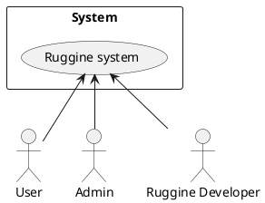
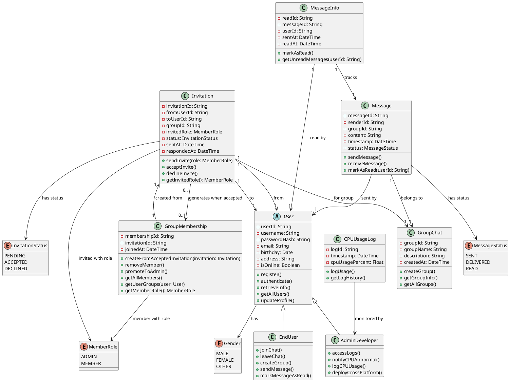
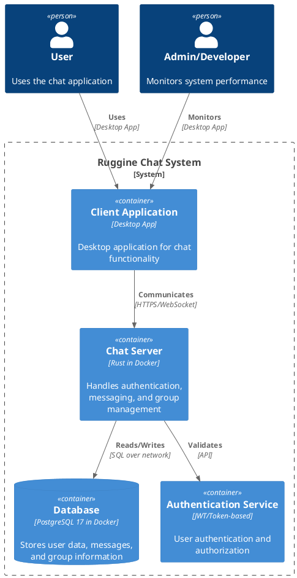
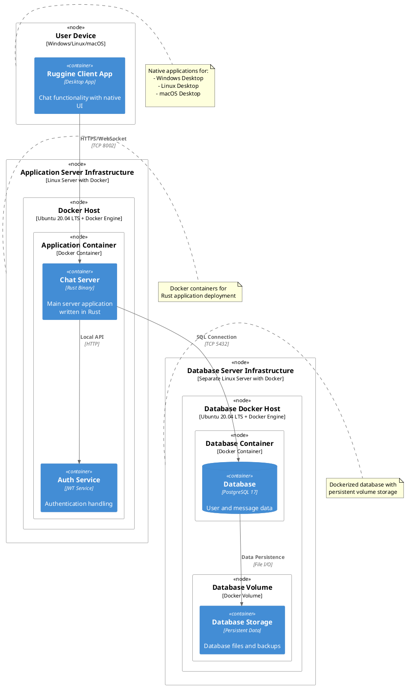

# Requirements Document - Ruggine

Date: July 17, 2025

Version: V1

| Version number | Change |
|:--------------:|:------:|
| V1 | Initial version: Basic system description |

# Contents

- [Requirements Document - GeoControl](#requirements-document---geocontrol)
- [Contents](#contents)
- [Informal description](#informal-description)
- [Stakeholders](#stakeholders)
- [Context Diagram and interfaces](#context-diagram-and-interfaces)
  - [Context Diagram](#context-diagram)
  - [Interfaces](#interfaces)
- [Stories and personas](#stories-and-personas)
- [Functional and non functional requirements](#functional-and-non-functional-requirements)
  - [Functional Requirements](#functional-requirements)
  - [Non Functional Requirements](#non-functional-requirements)
  - [Business Rules and Constraints](#business-rules-and-constraints)

# Informal description
Ruggine is a simple client/server chat application designed for exchanging text messages. Users can join the chat by registering the first time they open the app, and can be added to message groups only by invitation. The app supports group messaging and aims to work across at least two different platforms, such as Windows, Linux, macOS, Android, ChromeOS, or iOS.

Performance matters: the app should be lightweight and efficient, minimizing CPU usage and keeping the overall executable size as small as possible. Every 2 minutes, it should log CPU usage details to a database for performance tracking.

# Stakeholders
| Stakeholder | Description |
|:-------------|:-------------|
| Admin | Original commissioners of the system Individuals or entities who commissioned the project and define key goals |
| Ruggine Development and Management Team | Creators and maintainers of the software |
| Users | People who use the chat app to send messages and participate in groups  |

# Context Diagram and interfaces

## Context Diagram

## Interfaces

|     Actor      |             Logical Interface              |              Physical Interface              |
|:--------------:|:------------------------------------------:|:--------------------------------------------:|
| Admin/Ruggine developer          | Graphical User Interface (GUI)             | Mobile or desktop app with internet access |
| User           | Graphical User Interface (GUI)             | Mobile or desktop app with internet access   |

# Stories and Personas

## 1. Marco Bianchi – Admin (Internal) <!-- omit from toc -->
- **Role**: System administrator monitoring performance and logs
- **Responsibilities**:
  - Monitor CPU and memory usage of the application
  - Ensure the server is running efficiently
  - Access and read performance logs from the app
  - Report issues or anomalies to the development team

## 2. Laura Rossi – Ruggine Developer (Internal) <!-- omit from toc -->
- **Role**: Software engineer responsible for maintaining Ruggine
- **Responsibilities**:
  - Analyze performance logs from the GUI
  - Optimize CPU usage and reduce application size
  - Ensure cross-platform compatibility
  - Maintain application stability and fix bugs

## 3. Sofia Neri – End User (External) <!-- omit from toc -->
- **Role**: Regular chat app user
- **Responsibilities**:
  - Register through the mobile or desktop app
  - Send and receive messages in the chat groups
  - Join groups only via invitation
  - Create a group chat
  - Use the app on multiple platforms (e.g., Android, Windows)

## Key Scenarios <!-- omit from toc -->
1. **Monitor system performance** (Marco)
2. **Optimize application and debug issues** (Laura)
3. **Register and join a chat group** (Sofia)
4. **Exchange messages in group chat** (Sofia)

# Functional and non functional requirements 

# Functional Requirements

|   ID    | Description |
|:-------:|:------------|
| **FR1** | Manage users |
| FR1.1   | Register a new user |
| FR1.2   | Retrieve user information |
| FR1.3   | Update user information |
| FR1.4   | Retrieve a user by ID and username |
| **FR2** | Messaging functionality |
| FR2.1   | Send a text message to a chat group |
| FR2.2   | Receive a text message from a chat group |
| FR2.3   | Display group chat history between users |
| FR2.4   | Display not read messages |
| FR2.5   | Mark messages as read or sent |
| **FR3** | Group chat management |
| FR3.1   | Create a new group chat |
| FR3.2   | Retrieve group chat generic informations |
| **FR4** | Cross-platform compatibility |
| FR4.1   | Run the app on at least two platforms (e.g., Android and Windows) |
| **FR5** | Performance and resource monitoring |
| FR5.1   | Log CPU usage |
| FR5.2   | Store logs in a database and provide a API for retrieval |
| **FR6** | Authentication |
| FR6.2   | Authenticate users using their unique email on subsequent app launches |
| FR6.3   | Prevent unregistered users from accessing chat functionalities |
| FR6.4   | Ensure group access is only granted upon valid authentication |
| FR6.5   | Generate unique bearer tokens for user sessions |
| **FR7** | Invitation Management |
| FR7.1   | Invite users to a group chat |
| FR7.2   | Accept or decline group invitations |
| FR7.3   | Only admins of the group can send invitations |
| FR7.4   | A creator cannot send more than one invitation to a specific user when there is a pending invitation or he is already in the group|
| FR7.5   | Display pending invitations to the user |
| FR7.6   | Display a specific invitation to user (it must be the sender or the receiver) |
| FR7.7   | Display pending invitations to the user |
| **FR8** | Group Chat Membership Management |
| FR8.1   | Add a user to a group |
| FR8.2   | Remove a user from a group |
| FR8.3   | List all users in a group |
| FR8.4   | List all groups a user is part of |
| FR8.5   | Promote an active member to admin if none |
| FR8.6   | Display all online users connected to the logged one and logged one must be also online |

## Non Functional Requirements

|  ID   |          Type           |                                                                   Description                                                                   |     Refers to      |
|:-----:|:----------------------:|:-----------------------------------------------------------------------------------------------------------------------------------------------:|:------------------:|
| NFR1  |       Efficiency       |                    The application executable size must be kept as small as possible to optimize resource usage like under 30MB                               |        FR5         |
| NFR2  |        Security        |                          User authentication must be secure to prevent unauthorized access at 100%                                   |       FR6     |
| NFR3  |        Security        |            Group chat access must be restricted to invited users only, ensuring privacy and data protection at 100%                      |       FR2, FR7, FR8     |
| NFR4  |      Usability         |                 The app should provide a responsive and user-friendly interface across supported platforms and undestandble in 10 minutes                                   |       FR4|
| NFR5  |        Reliability     |             The logging system must consistently record CPU usage every 2 minutes without data loss                                           |       FR5,    |
| NFR6  |       Scalability      |      The system should be able to handle an increasing number of users and chat groups without performance degradation at maximum 10%                       |       FR2, FR7, FR8     |

## Business Rules and Constraints

|   ID    | Description |     Refers to      |
|:-------:|:------------|:------------------:|
| **BR1** | **User Management Rules** |
| BR1.1   | A user cannot register with an already existing email address | FR1.1 |
| BR1.2   | A user must be authenticated before accessing any chat functionality | FR6.2, FR6.3 |
| BR1.3   | Each user must have a unique username within the system | FR1.1, FR1.4 |
| BR1.4   | A user cannot update another user's profile information | FR1.3 |
| **BR2** | **Group Management Rules** |
| BR2.1   | A group must exist before any user can be added to it | FR8.1, FR3.2 |
| BR2.2   | A user must be a member of a group to send messages to it | FR2.1 |
| BR2.3   | A user must be a member of a group to view its message history | FR2.3 |
| BR2.4   | Only group admins can invite new users to the group | FR7.1, FR7.3 |
| BR2.5   | A group should have at least one admin at all times | FR8.5 |
| BR2.6   | A user cannot be added to a group they are already a member of | FR8.1 |
| BR2.7   | A group creator is automatically assigned as the first admin | FR3.1 |
| **BR3** | **Invitation Management Rules** |
| BR3.1   | An invitation can be send only by active admins of the group | FR7.4 |
| BR3.2   | Only one pending invitation per user per group is allowed at a time | FR7.4 |
| BR3.3   | An invitation cannot be sent to a user already in the group | FR7.4 |
| BR3.4   | Only the sender or receiver can view a specific invitation | FR7.6 |
| BR3.5   | An invitation must be in PENDING status to be accepted or declined | FR7.2 |
| BR3.6   | Once processed (accepted/declined), an invitation cannot be modified | FR7.2 |
| **BR4** | **Message Management Rules** |
| BR4.1   | A message cannot be marked as read more than once by the same user | FR2.5 |
| BR4.2   | A user can only mark messages as read in groups they are members of | FR2.5 |
| BR4.3   | Messages can only be sent to existing groups | FR2.1 |
| BR4.4   | Message timestamps must be immutable once created | FR2.1 |
| BR4.5   | A user can only view unread messages from groups they belong to | FR2.4 |
| **BR5** | **System and Performance Rules** |
| BR5.1   | CPU usage logs must be recorded exactly every 2 minutes | FR5.1 |
| BR5.2   | Performance logs can only be accessed by Admin/Developer users | FR5.2 |
| BR5.3   | Bearer tokens must expire after a defined period for security | FR6.5 |
| BR5.4   | The system must validate user authentication for every sensitive operation | FR6.2, FR6.4 |

# Use case diagram and use cases

## Use case diagram

```plantuml
@startuml
left to right direction

actor "End User" as User
actor "Admin / Developer" as AdminDev

rectangle "Ruggine Chat System" {
  
  ' User Management (FR1, FR6)
  usecase "Register User\n(FR1.1)" as UC_Register
  usecase "Authenticate User\n(FR6.2, FR6.3, FR6.4, FR6.5)" as UC_Auth
  usecase "Retrieve User Info\n(FR1.2, FR1.4)" as UC_RetrieveUser
  usecase "Update User Info\n(FR1.3)" as UC_UpdateUser
  usecase "Display Online Users\n(FR8.6)" as UC_OnlineUsers

  ' Group Management (FR3, FR8)
  usecase "Create Group Chat\n(FR3.1)" as UC_CreateGroup
  usecase "Retrieve Group Info\n(FR3.2)" as UC_RetrieveGroup
  usecase "List User Groups\n(FR8.4)" as UC_ListUserGroups
  usecase "List Group Members\n(FR8.3)" as UC_ListGroupMembers
  usecase "Add User to Group\n(FR8.1)" as UC_AddToGroup
  usecase "Remove User from Group\n(FR8.2)" as UC_RemoveFromGroup
  usecase "Promote Member to Admin\n(FR8.5)" as UC_PromoteAdmin

  ' Invitation Management (FR7)
  usecase "Send Group Invitation\n(FR7.1, FR7.3, FR7.4)" as UC_SendInvite
  usecase "Accept/Decline Invitation\n(FR7.2)" as UC_RespondInvite
  usecase "Display Pending Invitations\n(FR7.5, FR7.7)" as UC_ViewPendingInvites
  usecase "Display Specific Invitation\n(FR7.6)" as UC_ViewSpecificInvite

  ' Messaging (FR2)
  usecase "Send Message\n(FR2.1)" as UC_SendMsg
  usecase "Receive Message\n(FR2.2)" as UC_ReceiveMsg
  usecase "Display Chat History\n(FR2.3)" as UC_DisplayHistory
  usecase "Display Unread Messages\n(FR2.4)" as UC_UnreadMessages
  usecase "Mark Messages as Read/Sent\n(FR2.5)" as UC_MarkMessages

  ' Performance Monitoring (FR5)
  usecase "Log CPU Usage\n(FR5.1)" as UC_LogCPU
  usecase "Access Performance Logs\n(FR5.2)" as UC_AccessLogs

  ' Cross-platform Support (FR4)
  usecase "Run on Multiple Platforms\n(FR4.1)" as UC_CrossPlatform
}

' User connections
User --> UC_Register
User --> UC_Auth
User --> UC_RetrieveUser
User --> UC_UpdateUser
User --> UC_OnlineUsers

User --> UC_CreateGroup
User --> UC_RetrieveGroup
User --> UC_ListUserGroups
User --> UC_ListGroupMembers
User --> UC_AddToGroup
User --> UC_RemoveFromGroup
User --> UC_PromoteAdmin

User --> UC_SendInvite
User --> UC_RespondInvite
User --> UC_ViewPendingInvites
User --> UC_ViewSpecificInvite

User --> UC_SendMsg
User --> UC_ReceiveMsg
User --> UC_DisplayHistory
User --> UC_UnreadMessages
User --> UC_MarkMessages

' Admin/Developer connections
AdminDev --> UC_LogCPU
AdminDev --> UC_AccessLogs
AdminDev --> UC_CrossPlatform

@enduml


```

## Use Cases
### Use case 1, UC_Register: Register User

| Actors Involved  |            End User                                                       |
|:----------------:|:-------------------------------------------------------------------------:|
|   Precondition   | User opens the app for the first time and is not registered               |
|  Post condition  |  User is registered and assigned a unique user ID                         |
| Nominal Scenario |         User sends registration request and receives confirmation         |
|     Variants     | [Registration fails - email/username exists](#scenario-12-registration-fails), [Registration network error](#scenario-13-registration-network-error) |
|    Exceptions    | Server internal error, invalid user data submitted                        |

##### Scenario 1.1: Successful User Registration

|  Scenario 1.1  |         User Registration Success                                       |
|:--------------:|:------------------------------------------------------------------------:|
|  Precondition  | User opens the app for the first time                                   |
| Post condition | User has a unique user ID and can access chat functionalities            |
|     Step#      |                                Description                               |
| 1             | User launches the app and fills registration form (email, username, password) |
| 2             | App sends registration request to server                               |
| 3a            | Server validates email and username uniqueness (BR1.1, BR1.3)         |
| 3b            | Server returns error if email or username already exists              |
| 4             | Server generates unique user ID and returns success response           |
| 5             | User is logged in and granted access to the chat app                   |

##### Scenario 1.2: Registration Fails - Email/Username Exists

|  Scenario 1.2  |         Registration Failure                                           |
|:--------------:|:------------------------------------------------------------------------:|
|  Precondition  | User tries to register with existing email or username                |
| Post condition | Registration is rejected, user remains unregistered                   |
|     Step#      |                                Description                              |
| 1             | User launches the app and fills registration form                     |
| 2             | App sends registration request to server                              |
| 3             | Server checks email and username uniqueness (BR1.1, BR1.3)          |
| 4             | Server returns error "Email/Username already exists"                 |
| 5             | App displays error message to user                                   |

---

### Use case 2, UC_Auth: Authenticate User

| Actors Involved  |            End User                                                       |
|:----------------:|:-------------------------------------------------------------------------:|
|   Precondition   | User is registered and has a unique user ID                              |
|  Post condition  |  User is authenticated and granted access to chat functionalities        |
| Nominal Scenario |         User opens app and is authenticated automatically                |
|     Variants     | [Authentication failure - invalid user ID](#scenario-21-authentication-failure) |
|    Exceptions    | Server unavailable, network failure                                      |

##### Scenario 2.1: Successful Authentication

|  Scenario 2.1  |         User Authentication Success                                     |
|:--------------:|:------------------------------------------------------------------------:|
|  Precondition  | User has unique user ID                                                  |
| Post condition | User is authenticated and chat access is enabled                        |
|     Step#      |                                Description                               |
| 1             | User launches the app                                                    |
| 2             | App sends stored user ID to server for authentication                   |
| 3a            | Server validates user ID and authenticates user                         |
| 4             | Server returns success response                                         |
| 5             | User can access chat and groups                                         |

---

### Use case 3, UC_RetrieveUser: Retrieve User Info

| Actors Involved  |            End User                                                       |
|:----------------:|:-------------------------------------------------------------------------:|
|   Precondition   | User is authenticated                                                    |
|  Post condition  |  User info is retrieved and displayed                                   |
| Nominal Scenario |         User requests own profile information                            |
|     Variants     | None                                                                    |
|    Exceptions    | Server error, user info not found                                       |

##### Scenario 3.1: Retrieve User Info

|  Scenario 3.1  |         Retrieve User Info                                              |
|:--------------:|:------------------------------------------------------------------------:|
|  Precondition  | User is authenticated                                                   |
| Post condition | User info is shown on the app                                           |
|     Step#      |                                Description                              |
| 1             | User requests profile info                                              |
| 2             | Server fetches user data                                                |
| 3a            | Server sends user data to app                                           |
| 4             | App displays user info                                                  |

---

### Use case 4, UC_CreateGroup: Create Group Chat

| Actors Involved  |            End User                                                       |
|:----------------:|:-------------------------------------------------------------------------:|
|   Precondition   | User is authenticated and logged in                                     |
|  Post condition  |  New group chat is created and user is automatically assigned as group admin |
| Nominal Scenario |         User creates a new group chat via app interface                  |
|     Variants     | [Group name already exists](#scenario-41-group-name-exists)              |
|    Exceptions    | Server error, invalid group name                                         |

##### Scenario 4.1: Successful Group Creation

|  Scenario 4.1  |         Create New Group                                                 |
|:--------------:|:------------------------------------------------------------------------:|
|  Precondition  | User is authenticated and logged in                                     |
| Post condition | Group chat is created, user is assigned as admin (BR2.7)              |
|     Step#      |                                Description                               |
| 1             | User selects "Create Group" option                                     |
| 2             | User enters group name and description                                 |                           |
| 3             | Server creates new group and automatically assigns user as admin (BR2.7) with a |
| 4             | User is notified of successful group creation and admin status        |

---

### Use case 5, UC_InviteGroup: Invite Users to Group Chat

| Actors Involved  |            End User                                                       |
|:----------------:|:-------------------------------------------------------------------------:|
|   Precondition   | User is group admin and target user exists                              |
|  Post condition  |  Valid invitation is sent to eligible user                              |
| Nominal Scenario |         User invites others to join group chat                          |
|     Variants     | [Cannot invite self](#scenario-52-cannot-invite-self), [User already in group](#scenario-53-user-already-in-group), [Pending invitation exists](#scenario-54-pending-invitation-exists) |
|    Exceptions    | Server error, invalid user to invite, user not admin                   |

##### Scenario 5.1: Successful Group Invitation

|  Scenario 5.1  |         Invite User to Group                                            |
|:--------------:|:------------------------------------------------------------------------:|
|  Precondition  | User is authenticated, group admin, and target user is valid          |
| Post condition | Invitation sent to eligible user                                      |
|     Step#      |                                Description                              |
| 1             | Admin selects user to invite                                           |
| 2a            | Server validates admin cannot invite themselves (BR3.1)               |
| 2b            | Server checks user is not already in group (BR3.3)                   |
| 2c            | Server verifies no pending invitation exists (BR3.2)                 |
| 3             | Server creates invitation with PENDING status                         |
| 4             | Server sends invitation notification to user                          |
| 5             | Invited user receives invitation                                       |

##### Scenario 5.2: Cannot Invite Self

|  Scenario 5.2  |         Admin Tries to Invite Self                                     |
|:--------------:|:------------------------------------------------------------------------:|
|  Precondition  | User is group admin and selects themselves                            |
| Post condition | Invitation is rejected, no invitation sent                            |
|     Step#      |                                Description                              |
| 1             | Admin attempts to invite themselves                                    |
| 2             | Server validates and rejects self-invitation (BR3.1)                 |
| 3             | Server returns error "Cannot invite yourself"                        |
| 4             | App displays error message to admin                                   |

##### Scenario 5.3: User Already in Group

|  Scenario 5.3  |         Invite User Already in Group                                   |
|:--------------:|:------------------------------------------------------------------------:|
|  Precondition  | Target user is already a member of the group                          |
| Post condition | Invitation is rejected, no invitation sent                            |
|     Step#      |                                Description                              |
| 1             | Admin selects user already in group                                   |
| 2             | Server checks group membership (BR3.3)                               |
| 3             | Server returns error "User already in group"                         |
| 4             | App displays error message to admin                                   |

##### Scenario 5.4: Pending Invitation Exists

|  Scenario 5.4  |         Pending Invitation Already Exists                              |
|:--------------:|:------------------------------------------------------------------------:|
|  Precondition  | User already has a pending invitation for this group                  |
| Post condition | New invitation is rejected                                             |
|     Step#      |                                Description                              |
| 1             | Admin tries to invite user with pending invitation                    |
| 2             | Server checks for existing pending invitations (BR3.2)               |
| 3             | Server returns error "Pending invitation already exists"             |
| 4             | App displays error message to admin                                   |

---

### Use case 6, UC_InviteResponse: Accept or Decline Group Invitation

| Actors Involved  |            End User                                                       |
|:----------------:|:-------------------------------------------------------------------------:|
|   Precondition   | User has received a PENDING invitation                                  |
|  Post condition  |  User joins group (if accepted) or invitation is removed (if declined)  |
| Nominal Scenario |         User accepts or declines invitation                            |
|     Variants     | [Invitation not in pending status](#scenario-63-invitation-not-pending) |
|    Exceptions    | Server error, invitation not found                                     |

##### Scenario 6.1: Accept Invitation

|  Scenario 6.1  |         Accept Group Invitation                                        |
|:--------------:|:------------------------------------------------------------------------:|
|  Precondition  | User has a PENDING invitation (BR3.5)                                 |
| Post condition | User is added to the group, invitation status changed to ACCEPTED     |
|     Step#      |                                Description                              |
| 1             | User gets all pending invitations                                     |
| 2             | User selects "Accept" invitation                                      |
| 3             | Server validates invitation is in PENDING status (BR3.5)             |
| 4             | Server updates invitation status to ACCEPTED (BR3.6)                 |
| 5             | Server adds user to group membership                                  |
| 6             | User gains access to group chat                                       |

##### Scenario 6.2: Decline Invitation

|  Scenario 6.2  |         Decline Group Invitation                                       |
|:--------------:|:------------------------------------------------------------------------:|
|  Precondition  | User has a PENDING invitation (BR3.5)                                 |
| Post condition | Invitation status changed to DECLINED, user not added to group        |
|     Step#      |                                Description                              |
| 1             | User gets all pending invitations                                     |
| 2             | User selects "Decline" invitation                                     |
| 3             | Server validates invitation is in PENDING status (BR3.5)             |
| 4             | Server updates invitation status to DECLINED (BR3.6)                 |
| 5             | User cannot access group chat                                        |

##### Scenario 6.3: Invitation Not Pending

|  Scenario 6.3  |         Try to Respond to Non-Pending Invitation                      |
|:--------------:|:------------------------------------------------------------------------:|
|  Precondition  | User tries to respond to already processed invitation                 |
| Post condition | Response is rejected, invitation status unchanged                      |
|     Step#      |                                Description                              |
| 1             | User attempts to accept/decline processed invitation                  |
| 2             | Server checks invitation status (BR3.5)                              |
| 3             | Server returns error "Invitation already processed"                  |
| 4             | App displays error message to user                                   |

---

### Use case 7, UC_SendMsg: Send Message to Group

| Actors Involved  |            End User                                                       |
|:----------------:|:-------------------------------------------------------------------------:|
|   Precondition   | User is authenticated and member of the group chat                      |
|  Post condition  |  Message is sent to all group members with immutable timestamp          |
| Nominal Scenario |         User types and sends a text message in group chat               |
|     Variants     | [User not member of group](#scenario-72-user-not-member), [Group does not exist](#scenario-73-group-not-exist) |
|    Exceptions    | Server error, network failure                                           |

##### Scenario 7.1: Successful Message Sending

|  Scenario 7.1  |         Send Message to Group                                           |
|:--------------:|:------------------------------------------------------------------------:|
|  Precondition  | User is authenticated and member of existing group (BR2.2, BR4.3)     |
| Post condition | Message is delivered to group members with immutable timestamp (BR4.4) |
|     Step#      |                                Description                               |
| 1             | User types message in chat input box                                  |
| 2             | User clicks "Send"                                                     |
| 3a            | Server validates user is member of the group (BR2.2)                 |
| 3b            | Server validates group exists (BR4.3)                                |
| 4             | Server creates message with immutable timestamp (BR4.4)              |
| 5a            | Server broadcasts message to all group members                        |
| 5b            | Server confirms message delivery                                      |
| 6             | User sees message in chat history                                     |

##### Scenario 7.2: User Not Member

|  Scenario 7.2  |         User Not Member of Group                                       |
|:--------------:|:------------------------------------------------------------------------:|
|  Precondition  | User tries to send message to group they're not member of             |
| Post condition | Message is rejected, not sent                                         |
|     Step#      |                                Description                              |
| 1             | User attempts to send message to group                               |
| 2             | Server validates group membership (BR2.2)                            |
| 3             | Server returns error "Not a member of this group"                    |
| 4             | App displays error message to user                                   |

##### Scenario 7.3: Group Does Not Exist

|  Scenario 7.3  |         Group Does Not Exist                                          |
|:--------------:|:------------------------------------------------------------------------:|
|  Precondition  | User tries to send message to non-existent group                     |
| Post condition | Message is rejected, not sent                                         |
|     Step#      |                                Description                              |
| 1             | User attempts to send message to non-existent group                  |
| 2             | Server validates group existence (BR4.3)                             |
| 3             | Server returns error "Group does not exist"                          |
| 4             | App displays error message to user                                   |

---

### Use case 8, UC_ReceiveMsg: Receive Message from Group

| Actors Involved  |            End User                                                       |
|:----------------:|:-------------------------------------------------------------------------:|
|   Precondition   | User is authenticated and member of the group chat                      |
|  Post condition  |  User receives messages sent to the group                               |
| Nominal Scenario |         User app displays incoming messages                            |
|     Variants     | None                                                                   |
|    Exceptions    | Network failure                                                        |

##### Scenario 8.1: Successful Message Reception

|  Scenario 8.1  |         Receive Message from Group                                     |
|:--------------:|:------------------------------------------------------------------------:|
|  Precondition  | User is authenticated and part of the group                           |
| Post condition | Message is displayed in chat                                           |
|     Step#      |                                Description                              |
| 1             | Server pushes new message to client                                   |
| 2             | Client app displays new message                                       |

---

### Use case 9, UC_DisplayHistory: Display Group Chat History

| Actors Involved  |            End User                                                       |
|:----------------:|:-------------------------------------------------------------------------:|
|   Precondition   | User is authenticated and member of the group chat                      |
|  Post condition  |  Chat history is displayed                                             |
| Nominal Scenario |         User requests chat history                                      |
|     Variants     | None                                                                   |
|    Exceptions    | Server error                                                          |

##### Scenario 9.1: Display Chat History

|  Scenario 9.1  |         Display Chat History                                           |
|:--------------:|:------------------------------------------------------------------------:|
|  Precondition  | User is authenticated and member of group                             |
| Post condition | Chat history is shown                                                 |
|     Step#      |                                Description                              |
| 1             | User requests chat history                                            |
| 2             | Server fetches chat messages                                          |
| 3             | Server returns chat history                                           |
| 4             | App displays chat history                                             |

---

### Use case 10, UC_RetrieveGroup: Retrieve Group Info

| Actors Involved  |            End User                                                       |
|:----------------:|:-------------------------------------------------------------------------:|
|   Precondition   | User is authenticated and member of the group                           |
|  Post condition  |  Group info is retrieved and displayed                                 |
| Nominal Scenario |         User requests group details                                    |
|     Variants     | None                                                                   |
|    Exceptions    | Server error                                                          |

##### Scenario 10.1: Retrieve Group Info

|  Scenario 10.1 |         Retrieve Group Information                                      |
|:--------------:|:------------------------------------------------------------------------:|
|  Precondition  | User is authenticated and member of group                             |
| Post condition | Group info is displayed                                                |
|     Step#      |                                Description                              |
| 1             | User requests group info                                              |
| 2             | Server fetches group details                                          |
| 3             | Server returns group info                                             |
| 4             | App displays group info                                               |

---

### Use case 11, UC_MarkMessages: Mark Messages as Read

| Actors Involved  |            End User                                                       |
|:----------------:|:-------------------------------------------------------------------------:|
|   Precondition   | User is authenticated and member of the group with unread messages      |
|  Post condition  |  Selected messages are marked as read (only once per user)              |
| Nominal Scenario |         User marks unread messages as read                             |
|     Variants     | [Message already read](#scenario-112-message-already-read), [User not group member](#scenario-113-user-not-member) |
|    Exceptions    | Server error, message not found                                        |

##### Scenario 11.1: Successfully Mark Messages as Read

|  Scenario 11.1 |         Mark Messages as Read                                           |
|:--------------:|:------------------------------------------------------------------------:|
|  Precondition  | User is group member with unread messages (BR4.2)                     |
| Post condition | Messages marked as read, cannot be marked again (BR4.1)               |
|     Step#      |                                Description                              |
| 1             | User views unread messages in group chat                              |
| 2             | User selects messages to mark as read                                 |
| 3a            | Server validates user is member of group (BR4.2)                     |
| 3b            | Server checks messages haven't been marked as read before (BR4.1)    |
| 4             | Server updates message read status for this user                      |
| 5             | App updates UI to show messages as read                               |

##### Scenario 11.2: Message Already Read

|  Scenario 11.2 |         Try to Mark Already Read Message                               |
|:--------------:|:------------------------------------------------------------------------:|
|  Precondition  | User tries to mark message already marked as read                     |
| Post condition | Operation is rejected, status unchanged                                |
|     Step#      |                                Description                              |
| 1             | User attempts to mark already read message                            |
| 2             | Server checks if message already marked as read by this user (BR4.1) |
| 3             | Server returns error "Message already marked as read"                |
| 4             | App displays information message to user                             |

##### Scenario 11.3: User Not Group Member

|  Scenario 11.3 |         User Not Member of Group                                       |
|:--------------:|:------------------------------------------------------------------------:|
|  Precondition  | User tries to mark messages in group they're not member of            |
| Post condition | Operation is rejected                                                  |
|     Step#      |                                Description                              |
| 1             | User attempts to mark messages as read                                |
| 2             | Server validates user group membership (BR4.2)                       |
| 3             | Server returns error "Not a member of this group"                    |
| 4             | App displays error message to user                                   |

---

### Use case 12, UC_AccessLogs: Access Logs via CLI/File

| Actors Involved  |            Admin / Developer                                             |
|:----------------:|:-------------------------------------------------------------------------:|
|   Precondition   | AdminDev is authenticated                                                |
|  Post condition  |  Logs are accessed and displayed                                        |
| Nominal Scenario |         Admin accesses system logs via CLI or file system               |
|     Variants     | None                                                                   |
|    Exceptions    | Permission denied, logs unavailable                                   |

##### Scenario 11.1: Access Logs

|  Scenario 11.1 |         Access System Logs                                              |
|:--------------:|:------------------------------------------------------------------------:|
|  Precondition  | AdminDev is authenticated                                                |
| Post condition | Logs are displayed or accessible                                       |
|     Step#      |                                Description                              |
| 1             | AdminDev opens CLI or accesses log file directly                       |
| 2             | System fetches logs from storage                                       |
| 3             | Logs are displayed in CLI or file content is accessible               |

---

### Use case 12, UC_NotifyCPU: Notify Abnormal CPU Usage

| Actors Involved  |            Admin / Developer                                             |
|:----------------:|:-------------------------------------------------------------------------:|
|   Precondition   | CPU monitoring is active                                                |
|  Post condition  |  Admin is notified on abnormal CPU usage                               |
| Nominal Scenario |         System detects abnormal CPU and sends notification             |
|     Variants     | None                                                                   |
|    Exceptions    | Notification system failure                                           |

##### Scenario 12.1: CPU Usage Notification

|  Scenario 12.1 |         Notify Admin of Abnormal CPU Usage                            |
|:--------------:|:------------------------------------------------------------------------:|
|  Precondition  | CPU monitoring active                                                  |
| Post condition | Admin receives notification                                           |
|     Step#      |                                Description                              |
| 1             | System detects abnormal CPU usage                                     |
| 2             | System sends notification to Admin                                   |
| 3             | Admin acknowledges notification                                      |

---

### Use case 13, UC_LogCPU: Log CPU Usage

| Actors Involved  |            Admin / Developer                                             |
|:----------------:|:-------------------------------------------------------------------------:|
|   Precondition   | CPU usage monitoring system is active                                   |
|  Post condition  |  CPU usage logs are created exactly every 2 minutes                   |
| Nominal Scenario |         System logs CPU usage periodically according to schedule        |
|     Variants     | None                                                                   |
|    Exceptions    | Log storage failure, monitoring system failure                         |

##### Scenario 13.1: Log CPU Usage

|  Scenario 13.1 |         Log CPU Usage                                                  |
|:--------------:|:------------------------------------------------------------------------:|
|  Precondition  | CPU monitoring active and 2-minute interval elapsed (BR5.1)           |
| Post condition | CPU usage data is logged with precise timing                          |
|     Step#      |                                Description                              |
| 1             | System timer triggers exactly every 2 minutes (BR5.1)                |
| 2             | System samples current CPU usage percentage                           |
| 3             | System creates log entry with timestamp and CPU data                 |
| 4             | System writes log entry to storage                                   |
| 5             | Logs stored for later access by Admin/Developer (BR5.2)              |

---

### Use case 14, UC_CrossPlatform: Run on Multiple Platforms

| Actors Involved  |            Admin / Developer                                             |
|:----------------:|:-------------------------------------------------------------------------:|
|   Precondition   | System is deployed                                                     |
|  Post condition  |  System runs on multiple platforms                                     |
| Nominal Scenario |         System is installed and runs on Windows, Linux, macOS          |
|     Variants     | None                                                                   |
|    Exceptions    | Platform incompatibility                                               |

##### Scenario 14.1: Cross-Platform Operation

|  Scenario 14.1 |         Run on Multiple Platforms                                     |
|:--------------:|:------------------------------------------------------------------------:|
|  Precondition  | System is deployed                                                     |
| Post condition | System works on all supported platforms                               |
|     Step#      |                                Description                              |
| 1             | Developer builds system for target platform                           |
| 2             | System is installed on platform                                       |
| 3             | System runs and performs all functions                               |

### Use case 15, UC_PartOfGroup: User joins a group

| Actors Involved  |            Admin / Developer                                             |
|:----------------:|:-------------------------------------------------------------------------:|
|   Precondition   | User is authenticated                                                  |
|  Post condition  |  User is added to the group                                            |
| Nominal Scenario |         User requests to join a group                                   |
|     Variants     | None                                                                   |
|    Exceptions    | Group not found, User already in group, Pending invitation not found            |

##### Scenario 15.1: User Joins Group

|  Scenario 15.1 |         User Joins Group                                              |
|:--------------:|:------------------------------------------------------------------------:|
|  Precondition  | User is authenticated and group exists                                |
| Post condition | User is added to the group                                             |
|     Step#      |                                Description                              |
| 1             | User sends join request to group                                      |
| 2             | System verifies user and group                                         |
| 3             | System adds user to group                                             |
| Nominal Scenario |         System logs CPU usage periodically                             |
|     Variants     | None                                                                   |
|    Exceptions    | Group not found, User already in the group, Pending invitation not found            |

---

# Glossary

| Term             | Definition                                                                                  |
|------------------|---------------------------------------------------------------------------------------------|
| **User**         | An end user of the Ruggine Chat System who registers, authenticates, and participates in chats. |
| **Admin / Developer** | A user with administrative privileges who manages logs, CPU monitoring, and platform support. |
| **Group Chat**   | A chat room where multiple users can send and receive messages.                            |
| **Group Membership**   | The status of being a member of a group chat, allowing users to participate in discussions.                            |
| **Invitation**   | A request sent by a user to invite another user to join a group chat.                      |
| **Message**      | A unit of communication sent by users within a group chat.                                |
| **CPU Usage Log**| A recorded entry of the CPU usage at a given time, monitored by the system.                |
| **Authentication**| The process of verifying a user’s identity to allow access to the system.                 |
| **Chat History** | The stored messages from a group chat session available for review by the users.          |

---

# Class Diagram

---

# System Design

The Ruggine Chat System follows a client-server architecture with the following key components:

## System Architecture

## Component Interaction

The system components interact as follows:

1. **Client Application**: Desktop application that handles user interactions
2. **Chat Server**: Core business logic written in Rust, deployed in Docker containers for messaging, groups, and user management
3. **Database**: Persistent storage for all application data, hosted in Docker containers on a separate database server
4. **Authentication Service**: Handles user registration and login security using JWT tokens

---

# Deployment Diagram

The deployment diagram shows how the Ruggine Chat System components are distributed across different hardware and software platforms:

## Deployment Specifications

### Client Deployment
- **Platforms**: Windows, Linux, macOS (Desktop)
- **Application Type**: desktop applications
- **Requirements**: 
  - Desktop: Minimum 2GB RAM, 100MB storage space
  - Internet connection

### Server Deployment (Docker-based)
- **Infrastructure**: Docker containers on Linux servers
- **Operating System**: Ubuntu 20.04 LTS with Docker Engine
- **Hardware Requirements**:
  - Minimum 4GB RAM
  - Minimum 4 CPU cores
  - 10GB storage (application server)
  - Network interface with stable internet connection
- **Software Stack**:
  - Docker Engine 20.10+
  - Rust application compiled as Docker image
  - SSL/TLS certificates for HTTPS
  - Container orchestration tools (Docker Compose/Kubernetes)

### Database Server Deployment (Docker-based)
- **Infrastructure**: Docker containers on separate Linux servers
- **Operating System**: Ubuntu 20.04 LTS with Docker Engine
- **Hardware Requirements**:
  - Minimum 4GB RAM
  - Minimum 6 CPU cores
  - 20GB+ storage (database + Docker volumes)
  - High-speed network interface
- **Software Stack**:
  - Docker Engine 20.10+
  - PostgreSQL 17 Docker images
  - Docker volumes for persistent data storage
  - Database backup and recovery containers

### Network Requirements
- **Client-Server**: HTTPS (port 8002) or WebSocket (port 8002)
- **Server-Database**: MySQL (port 3306) or PostgreSQL (port 5432, secure network between containers)
- **Container Communication**: Docker network bridges for inter-container communication

### Scalability Considerations
- Load balancer can be added for multiple Rust server containers
- Database clustering and replication using Docker containers for high availability
- Container orchestration (Docker Swarm/Kubernetes) for cloud deployment
- Rust's performance characteristics enable efficient resource utilization in containers
- Separate database server allows for independent scaling of storage and compute resources
- Docker containers enable easy horizontal scaling and deployment automation