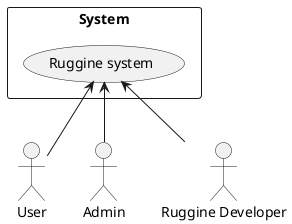
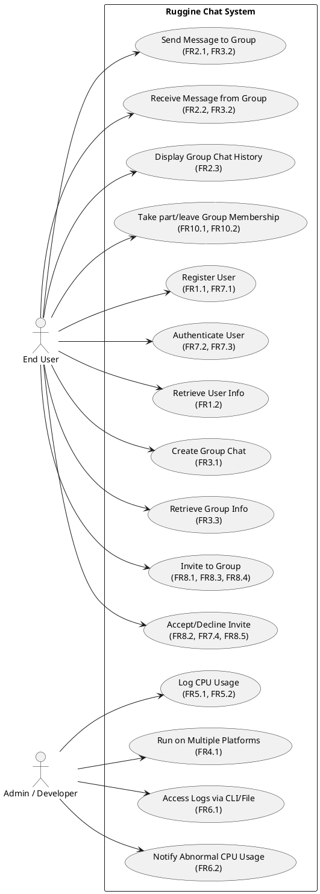
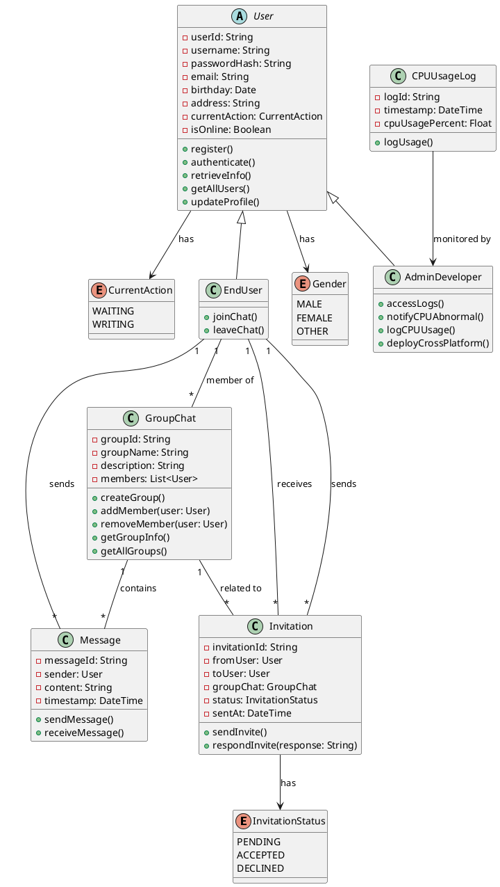
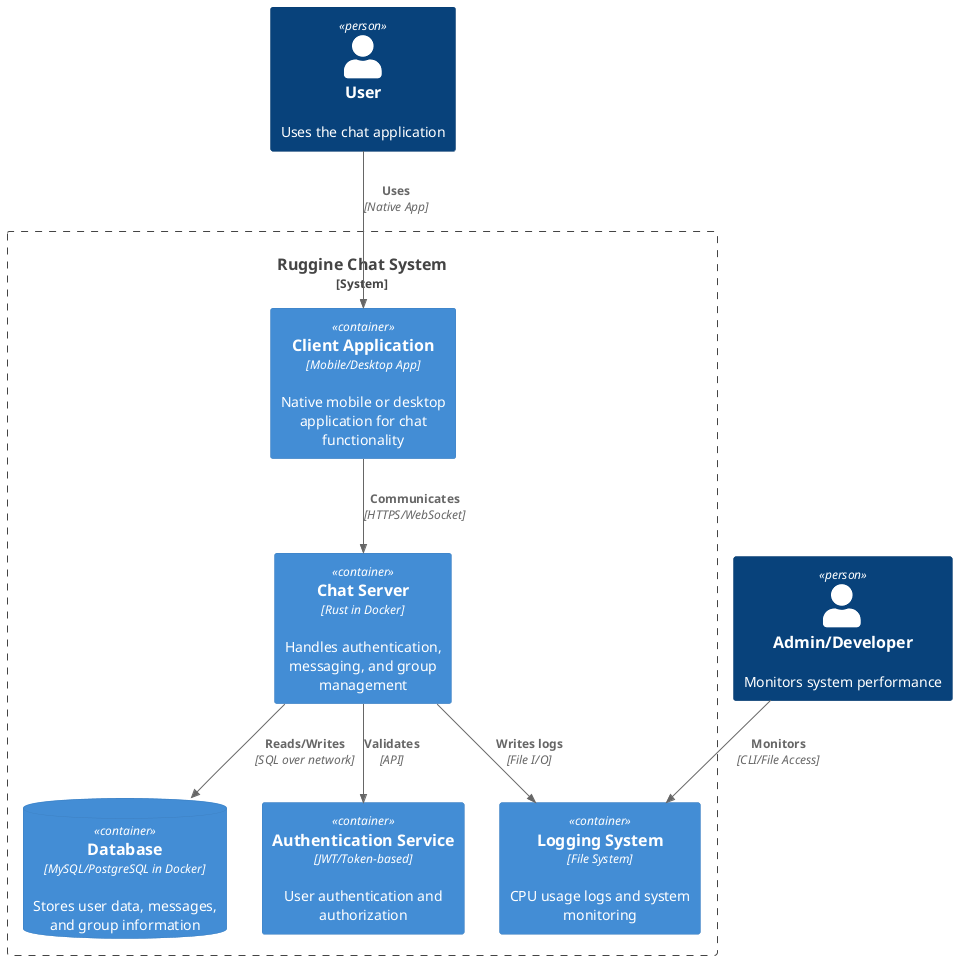
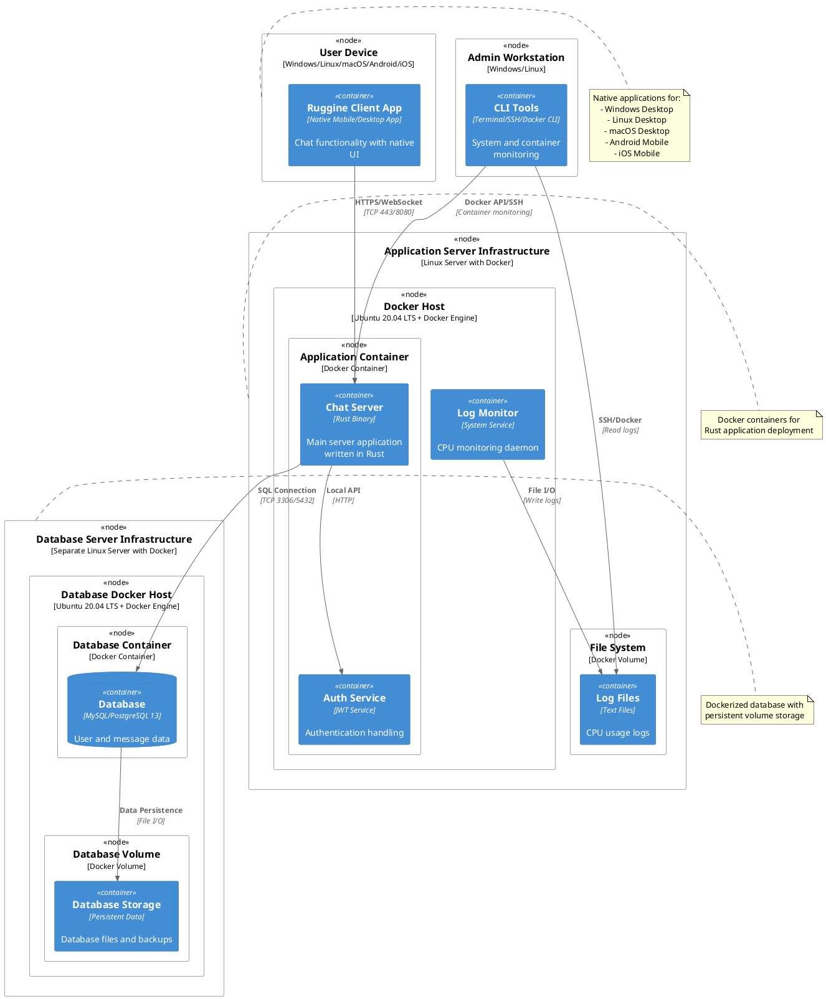

# Requirements Document - Ruggine

Date: July 17, 2025

Version: V1

| Version number | Change |
|:--------------:|:------:|
| V1 | Initial version: Basic system description |

# Contents

- [Requirements Document - GeoControl](#requirements-document---geocontrol)
- [Contents](#contents)
- [Informal description](#informal-description)
- [Stakeholders](#stakeholders)
- [Context Diagram and interfaces](#context-diagram-and-interfaces)
  - [Context Diagram](#context-diagram)
  - [Interfaces](#interfaces)
- [Stories and personas](#stories-and-personas)
- [Functional and non functional requirements](#functional-and-non-functional-requirements)
  - [Functional Requirements](#functional-requirements)
  - [Non Functional Requirements](#non-functional-requirements)

# Informal description
Ruggine is a simple client/server chat application designed for exchanging text messages. Users can join the chat by registering the first time they open the app, and can be added to message groups only by invitation. The app supports group messaging and aims to work across at least two different platforms, such as Windows, Linux, macOS, Android, ChromeOS, or iOS.

Performance matters: the app should be lightweight and efficient, minimizing CPU usage and keeping the overall executable size as small as possible. Every 2 minutes, it should log CPU usage details to a log file for performance tracking.

# Stakeholders
| Stakeholder | Description |
|:-------------|:-------------|
| Admin | Original commissioners of the system Individuals or entities who commissioned the project and define key goals |
| Ruggine Development and Management Team | Creators and maintainers of the software |
| Users | People who use the chat app to send messages and participate in groups  |

# Context Diagram and interfaces

## Context Diagram

## Interfaces

|     Actor      |             Logical Interface              |              Physical Interface              |
|:--------------:|:------------------------------------------:|:--------------------------------------------:|
| Admin/Ruggine developer          | Command Line Interface (CLI)               | Terminal on a device connected to the server |
| User           | Graphical User Interface (GUI)             | Mobile or desktop app with internet access   |

# Stories and Personas

## 1. Marco Bianchi – Admin (Internal) <!-- omit from toc -->
- **Role**: System administrator monitoring performance and logs
- **Responsibilities**:
  - Monitor CPU and memory usage of the application
  - Ensure the server is running efficiently
  - Access and read performance logs from the terminal
  - Report issues or anomalies to the development team

## 2. Laura Rossi – Ruggine Developer (Internal) <!-- omit from toc -->
- **Role**: Software engineer responsible for maintaining Ruggine
- **Responsibilities**:
  - Analyze performance logs from the CLI
  - Optimize CPU usage and reduce application size
  - Ensure cross-platform compatibility
  - Maintain application stability and fix bugs

## 3. Sofia Neri – End User (External) <!-- omit from toc -->
- **Role**: Regular chat app user
- **Responsibilities**:
  - Register through the mobile or desktop app
  - Send and receive messages in the chat groups
  - Join groups only via invitation
  - Create a group chat
  - Use the app on multiple platforms (e.g., Android, Windows)

## Key Scenarios <!-- omit from toc -->
1. **Monitor system performance** (Marco)
2. **Optimize application and debug issues** (Laura)
3. **Register and join a chat group** (Sofia)
4. **Exchange messages in group chat** (Sofia)

# Functional and non functional requirements 

# Functional Requirements

|   ID    | Description |
|:-------:|:------------|
| **FR1** | Manage users |
| FR1.1   | Register a new user |
| FR1.2   | Retrieve user information |
| **FR2** | Messaging functionality |
| FR2.1   | Send a text message to a chat group |
| FR2.2   | Receive a text message from a chat group |
| FR2.3   | Display group chat history between users |
| **FR3** | Group chat management |
| FR3.1   | Create a new group chat |
| FR3.3   | Retrieve group chat participants and informations |
| **FR4** | Cross-platform compatibility |
| FR4.1   | Run the app on at least two platforms (e.g., Android and Windows) |
| **FR5** | Performance and resource monitoring |
| FR5.1   | Log CPU usage |
| FR5.2   | Store logs in a local file and display them via command line interface |
| **FR6** | System monitoring interface |
| FR6.1   | Allow admin and developers to access logs both via command line and file system |
| FR6.2   | Notify admin of abnormal CPU usage |
|   ID    | Description |
| **FR7** | Authentication |
| FR7.1   | Generate a unique user ID upon first registration |
| FR7.2   | Authenticate users using their unique ID on subsequent app launches |
| FR7.3   | Prevent unregistered users from accessing chat functionalities |
| FR7.4   | Ensure group access is only granted upon valid invitation |
| **FR8** | Invitation Management |
| FR8.1   | Invite users to a group chat |
| FR8.2   | Accept or decline group invitations |
| FR8.3   | Only the creator of the group can send invitations |
| FR8.4   | A creator cannot send more than one invitation to a specific user when there is a pending invitation or he is already in the group or send to himself the invitation |
| FR8.5   | Display pending invitations to the user |
| **FR9** | Messages Management |
| FR9.1   | Send and receive messages within a group only if you are a participant |
| FR9.2   | Display messages in the group chat history only if you are a participant |
| **FR10** | Group Chat Memebership Management |
| FR10.1   | Add a user to a group |
| FR10.2   | Remove a user from a group |

## Non Functional Requirements

|  ID   |          Type           |                                                                   Description                                                                   |     Refers to      |
|:-----:|:----------------------:|:-----------------------------------------------------------------------------------------------------------------------------------------------:|:------------------:|
| NFR1  |       Performance       |                   The system must minimize CPU usage during chat operations and logging to avoid degrading user experience with a maximum perfomance loss of 5%                     |       FR5, FR7     |
| NFR2  |       Efficiency       |                    The application executable size must be kept as small as possible to optimize resource usage like under 10MB                               |        FR5         |
| NFR3  |        Security        |                          User authentication must be secure to prevent unauthorized access at 100%                                   |       FR1, FR7     |
| NFR4  |        Security        |            Group chat access must be restricted to invited users only, ensuring privacy and data protection at 100%                      |       FR3, FR7     |
| NFR5  |      Usability         |                 The app should provide a responsive and user-friendly interface across supported platforms and undestandble in 10 minutes                                   |       FR2, FR3, FR4|
| NFR6  |        Reliability     |             The logging system must consistently record CPU usage every 2 minutes without data loss                                           |       FR5, FR6     |
| NFR7  |       Scalability      |      The system should be able to handle an increasing number of users and chat groups without performance degradation at maximum 10%                       |       FR2, FR3     |

# Use case diagram and use cases

## Use case diagram

## Use Cases
### Use case 1, UC_Register: Register User

| Actors Involved  |            End User                                                       |
|:----------------:|:-------------------------------------------------------------------------:|
|   Precondition   | User opens the app for the first time and is not registered               |
|  Post condition  |  User is registered and assigned a unique user ID                         |
| Nominal Scenario |         User sends registration request and receives confirmation         |
|     Variants     | [Registration fails - username exists](#scenario-11-registration-fails), [Registration network error](#scenario-12-registration-network-error) |
|    Exceptions    | Server internal error, invalid user data submitted                        |

##### Scenario 1.1: Successful User Registration

|  Scenario 1.1  |         User Registration Success                                       |
|:--------------:|:------------------------------------------------------------------------:|
|  Precondition  | User opens the app for the first time                                   |
| Post condition | User has a unique user ID and can access chat functionalities            |
|     Step#      |                                Description                               |
| 1             | User launches the app and fills registration form                       |
| 2             | App sends registration request to server                               |
| 3a            | Server validates and accepts the registration                           |
| 4             | Server generates unique user ID and returns success response           |
| 5             | User is logged in and granted access to the chat app                   |

---

### Use case 2, UC_Auth: Authenticate User

| Actors Involved  |            End User                                                       |
|:----------------:|:-------------------------------------------------------------------------:|
|   Precondition   | User is registered and has a unique user ID                              |
|  Post condition  |  User is authenticated and granted access to chat functionalities        |
| Nominal Scenario |         User opens app and is authenticated automatically                |
|     Variants     | [Authentication failure - invalid user ID](#scenario-21-authentication-failure) |
|    Exceptions    | Server unavailable, network failure                                      |

##### Scenario 2.1: Successful Authentication

|  Scenario 2.1  |         User Authentication Success                                     |
|:--------------:|:------------------------------------------------------------------------:|
|  Precondition  | User has unique user ID                                                  |
| Post condition | User is authenticated and chat access is enabled                        |
|     Step#      |                                Description                               |
| 1             | User launches the app                                                    |
| 2             | App sends stored user ID to server for authentication                   |
| 3a            | Server validates user ID and authenticates user                         |
| 4             | Server returns success response                                         |
| 5             | User can access chat and groups                                         |

---

### Use case 3, UC_RetrieveUser: Retrieve User Info

| Actors Involved  |            End User                                                       |
|:----------------:|:-------------------------------------------------------------------------:|
|   Precondition   | User is authenticated                                                    |
|  Post condition  |  User info is retrieved and displayed                                   |
| Nominal Scenario |         User requests own profile information                            |
|     Variants     | None                                                                    |
|    Exceptions    | Server error, user info not found                                       |

##### Scenario 3.1: Retrieve User Info

|  Scenario 3.1  |         Retrieve User Info                                              |
|:--------------:|:------------------------------------------------------------------------:|
|  Precondition  | User is authenticated                                                   |
| Post condition | User info is shown on the app                                           |
|     Step#      |                                Description                              |
| 1             | User requests profile info                                              |
| 2             | Server fetches user data                                                |
| 3a            | Server sends user data to app                                           |
| 4             | App displays user info                                                  |

---

### Use case 4, UC_CreateGroup: Create Group Chat

| Actors Involved  |            End User                                                       |
|:----------------:|:-------------------------------------------------------------------------:|
|   Precondition   | User is authenticated and logged in                                     |
|  Post condition  |  New group chat is created and user is the group admin                   |
| Nominal Scenario |         User creates a new group chat via app interface                  |
|     Variants     | [Group name already exists](#scenario-41-group-name-exists)              |
|    Exceptions    | Server error, invalid group name                                         |

##### Scenario 4.1: Successful Group Creation

|  Scenario 4.1  |         Create New Group                                                 |
|:--------------:|:------------------------------------------------------------------------:|
|  Precondition  | User is logged in                                                       |
| Post condition | Group chat is created and visible to invited users                     |
|     Step#      |                                Description                               |
| 1             | User selects "Create Group" option                                     |
| 2             | User enters group name and description                                 |
| 3a            | Server checks for group name uniqueness                                |
| 3b            | Server returns error if group name exists                             |
| 4             | Server creates new group and assigns user as admin                    |
| 5             | User is notified of successful group creation                         |

---

### Use case 5, UC_InviteGroup: Invite Users to Group Chat

| Actors Involved  |            End User                                                       |
|:----------------:|:-------------------------------------------------------------------------:|
|   Precondition   | User is group admin                                                     |
|  Post condition  |  Invited users receive group invitations                                |
| Nominal Scenario |         User invites others to join group chat                          |
|     Variants     | [Invited already in group, pending invitation or already in the group chat](#scenario-51-invitee-already-in-group)       |
|    Exceptions    | Server error, invalid user to invite                                   |

##### Scenario 5.1: Successful Group Invitation

|  Scenario 5.1  |         Invite User to Group                                            |
|:--------------:|:------------------------------------------------------------------------:|
|  Precondition  | User is authenticated and group admin                                 |
| Post condition | Invite sent to user                                                    |
|     Step#      |                                Description                              |
| 1             | Admin selects user to invite                                           |
| 2             | Server sends invitation notification to user                          |
| 3             | Invited user receives invitation                                       |

---

### Use case 6, UC_InviteResponse: Accept or Decline Group Invitation

| Actors Involved  |            End User                                                       |
|:----------------:|:-------------------------------------------------------------------------:|
|   Precondition   | User has received an invitation                                         |
|  Post condition  |  User joins or declines group chat                                     |
| Nominal Scenario |         User accepts or declines invitation                            |
|     Variants     | None                                                                   |
|    Exceptions    | Server error                                                          |

##### Scenario 6.1: Accept Invitation

|  Scenario 6.1  |         Accept Group Invitation                                        |
|:--------------:|:------------------------------------------------------------------------:|
|  Precondition  | User has a pending invitation                                         |
| Post condition | User is added to the group                                           |
|     Step#      |                                Description                              |
| 1             | User gets all pending invitations                                     |
| 2             | User selects "Accept" invitation                                      |
| 3             | Server updates group membership                                       |
| 4             | User gains access to group chat                                       |

##### Scenario 6.2: Decline Invitation

|  Scenario 6.2  |         Decline Group Invitation                                       |
|:--------------:|:------------------------------------------------------------------------:|
|  Precondition  | User has a pending invitation                                         |
| Post condition | User is not added to the group                                        |
|     Step#      |                                Description                              |
| 1             | User gets all pending invitations                                     |
| 2             | User selects "Decline" invitation                                     |
| 3             | Server removes pending invitation                                    |
| 4             | User cannot access group chat                                        |

---

### Use case 7, UC_SendMsg: Send Message to Group

| Actors Involved  |            End User                                                       |
|:----------------:|:-------------------------------------------------------------------------:|
|   Precondition   | User is authenticated and member of the group chat                      |
|  Post condition  |  Message is sent to all group members                                   |
| Nominal Scenario |         User types and sends a text message in group chat               |
|     Variants     | [Message send failure - network error](#scenario-71-message-send-failure)|
|    Exceptions    | Server error, user not member of group                                  |

##### Scenario 7.1: Successful Message Sending

|  Scenario 7.1  |         Send Message to Group                                           |
|:--------------:|:------------------------------------------------------------------------:|
|  Precondition  | User is authenticated and part of the group                           |
| Post condition | Message is delivered to group members                                  |
|     Step#      |                                Description                               |
| 1             | User types message in chat input box                                  |
| 2             | User clicks "Send"                                                     |
| 3             | App sends message to server                                           |
| 4a            | Server broadcasts message to all group members                        |
| 4b            | Server confirms message delivery                                      |
| 5             | User sees message in chat history                                     |

---

### Use case 8, UC_ReceiveMsg: Receive Message from Group

| Actors Involved  |            End User                                                       |
|:----------------:|:-------------------------------------------------------------------------:|
|   Precondition   | User is authenticated and member of the group chat                      |
|  Post condition  |  User receives messages sent to the group                               |
| Nominal Scenario |         User app displays incoming messages                            |
|     Variants     | None                                                                   |
|    Exceptions    | Network failure                                                        |

##### Scenario 8.1: Successful Message Reception

|  Scenario 8.1  |         Receive Message from Group                                     |
|:--------------:|:------------------------------------------------------------------------:|
|  Precondition  | User is authenticated and part of the group                           |
| Post condition | Message is displayed in chat                                           |
|     Step#      |                                Description                              |
| 1             | Server pushes new message to client                                   |
| 2             | Client app displays new message                                       |

---

### Use case 9, UC_DisplayHistory: Display Group Chat History

| Actors Involved  |            End User                                                       |
|:----------------:|:-------------------------------------------------------------------------:|
|   Precondition   | User is authenticated and member of the group chat                      |
|  Post condition  |  Chat history is displayed                                             |
| Nominal Scenario |         User requests chat history                                      |
|     Variants     | None                                                                   |
|    Exceptions    | Server error                                                          |

##### Scenario 9.1: Display Chat History

|  Scenario 9.1  |         Display Chat History                                           |
|:--------------:|:------------------------------------------------------------------------:|
|  Precondition  | User is authenticated and member of group                             |
| Post condition | Chat history is shown                                                 |
|     Step#      |                                Description                              |
| 1             | User requests chat history                                            |
| 2             | Server fetches chat messages                                          |
| 3             | Server returns chat history                                           |
| 4             | App displays chat history                                             |

---

### Use case 10, UC_RetrieveGroup: Retrieve Group Info

| Actors Involved  |            End User                                                       |
|:----------------:|:-------------------------------------------------------------------------:|
|   Precondition   | User is authenticated and member of the group                           |
|  Post condition  |  Group info is retrieved and displayed                                 |
| Nominal Scenario |         User requests group details                                    |
|     Variants     | None                                                                   |
|    Exceptions    | Server error                                                          |

##### Scenario 10.1: Retrieve Group Info

|  Scenario 10.1 |         Retrieve Group Information                                      |
|:--------------:|:------------------------------------------------------------------------:|
|  Precondition  | User is authenticated and member of group                             |
| Post condition | Group info is displayed                                                |
|     Step#      |                                Description                              |
| 1             | User requests group info                                              |
| 2             | Server fetches group details                                          |
| 3             | Server returns group info                                             |
| 4             | App displays group info                                               |

---

### Use case 11, UC_AccessLogs: Access Logs via CLI/File

| Actors Involved  |            Admin / Developer                                             |
|:----------------:|:-------------------------------------------------------------------------:|
|   Precondition   | AdminDev is authenticated                                                |
|  Post condition  |  Logs are accessed and displayed                                        |
| Nominal Scenario |         Admin accesses system logs via CLI or file system               |
|     Variants     | None                                                                   |
|    Exceptions    | Permission denied, logs unavailable                                   |

##### Scenario 11.1: Access Logs

|  Scenario 11.1 |         Access System Logs                                              |
|:--------------:|:------------------------------------------------------------------------:|
|  Precondition  | AdminDev is authenticated                                                |
| Post condition | Logs are displayed or accessible                                       |
|     Step#      |                                Description                              |
| 1             | AdminDev opens CLI or accesses log file directly                       |
| 2             | System fetches logs from storage                                       |
| 3             | Logs are displayed in CLI or file content is accessible               |

---

### Use case 12, UC_NotifyCPU: Notify Abnormal CPU Usage

| Actors Involved  |            Admin / Developer                                             |
|:----------------:|:-------------------------------------------------------------------------:|
|   Precondition   | CPU monitoring is active                                                |
|  Post condition  |  Admin is notified on abnormal CPU usage                               |
| Nominal Scenario |         System detects abnormal CPU and sends notification             |
|     Variants     | None                                                                   |
|    Exceptions    | Notification system failure                                           |

##### Scenario 12.1: CPU Usage Notification

|  Scenario 12.1 |         Notify Admin of Abnormal CPU Usage                            |
|:--------------:|:------------------------------------------------------------------------:|
|  Precondition  | CPU monitoring active                                                  |
| Post condition | Admin receives notification                                           |
|     Step#      |                                Description                              |
| 1             | System detects abnormal CPU usage                                     |
| 2             | System sends notification to Admin                                   |
| 3             | Admin acknowledges notification                                      |

---

### Use case 13, UC_LogCPU: Log CPU Usage

| Actors Involved  |            Admin / Developer                                             |
|:----------------:|:-------------------------------------------------------------------------:|
|   Precondition   | CPU usage is monitored                                                  |
|  Post condition  |  CPU usage logs are created                                            |
| Nominal Scenario |         System logs CPU usage periodically                             |
|     Variants     | None                                                                   |
|    Exceptions    | Log storage failure                                                   |

##### Scenario 13.1: Log CPU Usage

|  Scenario 13.1 |         Log CPU Usage                                                  |
|:--------------:|:------------------------------------------------------------------------:|
|  Precondition  | CPU monitoring active                                                  |
| Post condition | CPU usage data is logged                                              |
|     Step#      |                                Description                              |
| 1             | System samples CPU usage                                              |
| 2             | System writes log entry                                              |
| 3             | Logs stored for later access                                         |

---

### Use case 14, UC_CrossPlatform: Run on Multiple Platforms

| Actors Involved  |            Admin / Developer                                             |
|:----------------:|:-------------------------------------------------------------------------:|
|   Precondition   | System is deployed                                                     |
|  Post condition  |  System runs on multiple platforms                                     |
| Nominal Scenario |         System is installed and runs on Windows, Linux, macOS          |
|     Variants     | None                                                                   |
|    Exceptions    | Platform incompatibility                                               |

##### Scenario 14.1: Cross-Platform Operation

|  Scenario 14.1 |         Run on Multiple Platforms                                     |
|:--------------:|:------------------------------------------------------------------------:|
|  Precondition  | System is deployed                                                     |
| Post condition | System works on all supported platforms                               |
|     Step#      |                                Description                              |
| 1             | Developer builds system for target platform                           |
| 2             | System is installed on platform                                       |
| 3             | System runs and performs all functions                               |

# Glossary

| Term             | Definition                                                                                  |
|------------------|---------------------------------------------------------------------------------------------|
| **User**         | An end user of the Ruggine Chat System who registers, authenticates, and participates in chats. |
| **Admin / Developer** | A user with administrative privileges who manages logs, CPU monitoring, and platform support. |
| **Group Chat**   | A chat room where multiple users can send and receive messages.                            |
| **Invitation**   | A request sent by a user to invite another user to join a group chat.                      |
| **Message**      | A unit of communication sent by users within a group chat.                                |
| **CPU Usage Log**| A recorded entry of the CPU usage at a given time, monitored by the system.                |
| **Authentication**| The process of verifying a user’s identity to allow access to the system.                 |
| **Chat History** | The stored messages from a group chat session available for review by the users.          |

---

# Class Diagram

---

# System Design

The Ruggine Chat System follows a client-server architecture with the following key components:

## System Architecture

## Component Interaction

The system components interact as follows:

1. **Client Application**: Native mobile or desktop application that handles user interactions
2. **Chat Server**: Core business logic written in Rust, deployed in Docker containers for messaging, groups, and user management
3. **Database**: Persistent storage for all application data, hosted in Docker containers on a separate database server
4. **Authentication Service**: Handles user registration and login security using JWT tokens
5. **Logging System**: Monitors CPU usage and system performance

---

# Deployment Diagram

The deployment diagram shows how the Ruggine Chat System components are distributed across different hardware and software platforms:

## Deployment Specifications

### Client Deployment
- **Platforms**: Windows, Linux, macOS (Desktop), Android, iOS (Mobile)
- **Application Type**: Native mobile and desktop applications
- **Requirements**: 
  - Desktop: Minimum 2GB RAM, 100MB storage space
  - Mobile: Minimum 1GB RAM, 50MB storage space
  - Internet connection
  - Platform-specific frameworks (e.g., .NET for Windows, Cocoa for macOS, Android SDK, iOS SDK)

### Server Deployment (Docker-based)
- **Infrastructure**: Docker containers on Linux servers
- **Operating System**: Ubuntu 20.04 LTS with Docker Engine
- **Hardware Requirements**:
  - Minimum 4GB RAM
  - 2 CPU cores
  - 50GB storage (application server)
  - Network interface with stable internet connection
- **Software Stack**:
  - Docker Engine 20.10+
  - Rust application compiled as Docker image
  - SSL/TLS certificates for HTTPS
  - Container orchestration tools (Docker Compose/Kubernetes)

### Database Server Deployment (Docker-based)
- **Infrastructure**: Docker containers on separate Linux servers
- **Operating System**: Ubuntu 20.04 LTS with Docker Engine
- **Hardware Requirements**:
  - Minimum 8GB RAM
  - 4 CPU cores
  - 200GB+ storage (database + Docker volumes)
  - High-speed network interface
- **Software Stack**:
  - Docker Engine 20.10+
  - MySQL 8.0+ or PostgreSQL 13+ Docker images
  - Docker volumes for persistent data storage
  - Database backup and recovery containers

### Network Requirements
- **Client-Server**: HTTPS (port 443) or WebSocket (port 8080)
- **Server-Database**: MySQL (port 3306) or PostgreSQL (port 5432, secure network between containers)
- **Admin Access**: SSH (port 22) for remote administration, Docker API for container management
- **Container Communication**: Docker network bridges for inter-container communication

### Scalability Considerations
- Load balancer can be added for multiple Rust server containers
- Database clustering and replication using Docker containers for high availability
- Container orchestration (Docker Swarm/Kubernetes) for cloud deployment
- Rust's performance characteristics enable efficient resource utilization in containers
- Separate database server allows for independent scaling of storage and compute resources
- Docker containers enable easy horizontal scaling and deployment automation